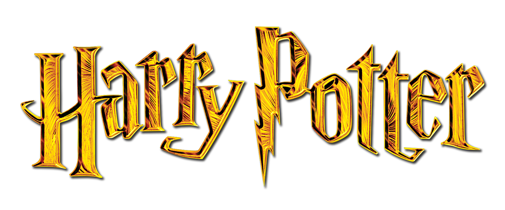

<h1 align="center">
  Spells Generator
</h1>
<div align="center">

</div>

<h4 align="center">All Harry Potter Spells<br><br></h4>

</br>

<p align="center"> 
    <a href="https://www.w3.org/html/" target="_blank" rel="noopener noreferrer"> 
         
    </a>
    <a href="https://sass-lang.com" target="_blank" rel="noopener noreferrer"> 
        
    </a>
    <a href="https://fr.reactjs.org/" target="_blank" rel="noopener noreferrer">
        
    </a>
    <a href="https://developer.wordpress.org/rest-api/" target="_blank" rel="noopener noreferrer">
        
    </a>
</p> 

</br>

<p align="center">
  <a href="https://jcdle-spell-generator.netlify.app" target="_blank" rel="noopener noreferrer">Online version</a> •
  <a href="#main-features">Features</a> •
  <a href="#run-the-app">Run the app</a>
</p>

<br>

<p align="center">
 
</p>

<br>

## Features


* Get a random spell


## Run the app

```bash

# Clone this repository
$ git clone https://github.com/JulieCardinale/spells-generator.git

# Go into the repository
$ cd spells-generator

# Install dependencies
$ yarn

# Run the app
$ yarn start

```
